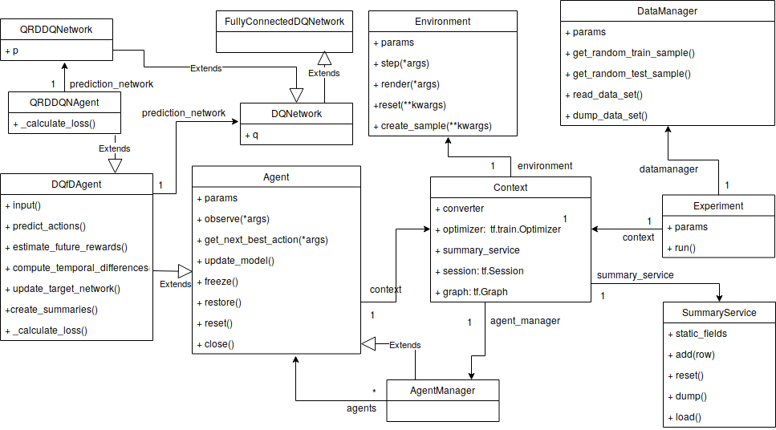

# **Diadem** = **D**eep **i**nter**a**ctive **de**cision **m**aking 

Diadem is a python library for development and training of interaction-aware decision making algorithms based on tensorflow<2.0. The focus is on combinations of Deep Reinforcement Learning with classical AI techniques, such as MCTS. Currently, the training and evaluation framework and DQN variants (prioritized experience replay, Learning from Demonstrations (DQfD), C51, Quantile Regression DQN) are implemented. With the environment wrapper class, the library allows integration of different environments, standard benchmarks such as [OpenAI Gym](https://gym.openai.com/) but also [bark](https://github.com/bark-simulator/bark), focusing on interactive decision making in multi-agent scenarios.  

## Prerequisites

* Bazel (requires Java)
* Python3
* virtualenv

## Installation on Ubuntu

1. Clone the repository and change to base repository directory 
2. `bash scripts/setup_venv.sh`: this will create a virtual python environment (located in ./venv) and install all necessary python dependencies.
2. `source scripts/into_venv.sh`: this will activate the virtual environment (keep this in mind for the future: each time you use Bazel, even beyond this installation, be sure to have run this command beforehand)
4. `bazel test //...`: this will run all specified tests. All tests should pass successfully. (individual tests can be executed e.g. with `//examples:dqn_basic`, e.g `bazel test
5. For online rendering of the environment use the run mode, e.g for the GymCartpole environment and DQN use `bazel run //examples:basic_dqn`

## Examples

The examples folder provides  use cases for a Quantile Regression DQN or Categorical DQN algorithm with the Gym environment wrapper. The configuration files extend from the [common configuration](./examples/example_params/common_parameters.yaml) by importing the `base` property in the common parameters file. This allows that you do not have to repeat every parameter in your experiment parameter file but only the ones that differ from the common configuration.

